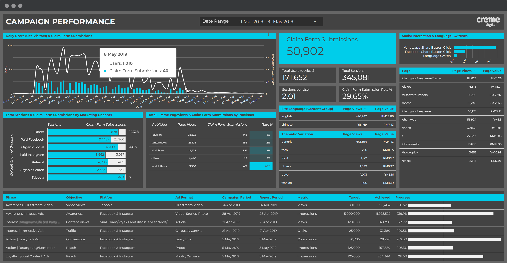

## Ad Platform Experience

`Meta` `Google Ads` `Teads` `Yahoo DSP` `TikTok` `Snapchat` `Spotify Ads` `Linkedin` `Microsoft Bing` `Taboola` `Outbrain` `Quora` `Zemanta` `Twitter Ads` `Reddit` `Tencent Global Ads` `AdsMurai`

## Github 👩🏻‍💻

**Notable contributions:**

Collation of global list of URL parameter fur use as exclusion, inclusion, filtering of analytics and/or ad platform pixel trigger critera.

- [Collection of Platform Click ID Parameters](https://github.com/cremedigital/platform-url-click-id-parameters)

Google Tag Manager Public Community templates (submitted to Google)

- [IPmeta Tag Template for GA4](https://github.com/cremedigital/gtm-templates-ipmeta-ga4)

- [Google Chat Tag Template & Formatting Guideline](https://github.com/cremedigital/gtm-templates-web-google-chat-webhook)

## Company Wiki Build

📷

## Dashboards & Visualization

📷

<!-- [F J Benjamin Reporting Dashboard](https://docs.google.com/spreadsheets/d/1qkfAaBlBQf9I49dO7we5yFu_ru98gTJz8L-DyDM_S4U/edit#gid=676303345)

[F J Benjamin Shopify Sales Dash](https://datastudio.google.com/reporting/bb6f9559-14f1-42f8-a7c4-42ca4e359b39/page/qfNwC)

[shopMYairports Data Extraction Sheet for Reporting](https://docs.google.com/spreadsheets/d/1Iv5dO2penYte8f1v8ZvTmgwxtebh81T5JgvtywYmR9I/edit#gid=916135176)

[MagnumLife with Geometry](https://datastudio.google.com/reporting/1glpT7ISpCAensCc1_fttUI64cSuL7LE5/page/T53k)

[Eastspring Performance](https://datastudio.google.com/reporting/d8aa726c-cacc-45ea-97e8-17251c457f37/page/nVtSC)
 -->

<!-- ## Ad Tech Proposals -->

<!-- [EatDrinkHilton Quotation](https://docs.google.com/spreadsheets/d/1kSchrqq6zu1n7QYYrbHlQ6ykEPimD7xrf6e6ld_n2Ug/edit#gid=601611144)

[Disney+ KOL Dashboard Build Methodology](https://docs.google.com/presentation/d/1w150B9eHcEjcSi4vcdu1MqTJYtFNGjkOW3dahcWKyNw/edit#slide=id.g11f064e672f_0_0) -->

## GA4, GTM Deployment

Audits and/or Full-scale enterprise GA+GTM deployments, including pre-sales, client management, training, planning of deployment, collaboration with in-house web developers and other subcontractors/vendors, including writing specifications for development.

📷 of hilton session

## SEO Audits

📷

<!-- [JOS.sg](https://docs.google.com/presentation/d/1qieMXueG42Kuodwi9KE_PufQhHqlqtuitfRapNlX0ko/edit?usp=sharing)

[IACT](https://drive.google.com/file/d/0B81tM5ZvIB45OFBSbVY3eDFYNXc/view?resourcekey=0-W6kE-R_Z_Uystr7fDLhhGQ) -->

## Advertising & MarTech Training & Mentorship 🎓

## Development of Agency Tracking System 🎲

Development, Iteration and Maintenance of Agency Campaign Tracker and Financial System.

📷

<!-- [Campaign Tracker](https://docs.google.com/spreadsheets/d/1OluvG1NqAGFDOHqxOGVWkKB8DfV9bFqhAV5dTfrIOhU/edit#gid=0). -->

## Document & SOP Development

📷

<!-- - [Gross Profit Tracker](https://docs.google.com/spreadsheets/d/1jqVSKZwT43mpEOh6XC1VUK_MEGoHdZl4z-GuTdtLgqI/edit#gid=1820864076)

- [Advertiser & Jobcode Finders](https://docs.google.com/spreadsheets/d/1cgFD_cxVnDvA-9kqiaNMx329kYcdprpvRFEQBLjQ1_4/edit#gid=1074452121)

- [AdOps Templates](https://docs.google.com/spreadsheets/d/1wPH3EJTS0OMxnsWEsxLPG6EE9H75ROSF4MnuP7lgpdY/edit#gid=0)

- [In2 Marketing Datastudio Reporting Template & Internal Guideline Processs](https://docs.google.com/spreadsheets/d/17JgNyEg5xSjewBvLghixOyZ1IZESUGhRMCe10juXqWc/edit#gid=0)

- [Propaganda Operations Guidelines](https://docs.google.com/spreadsheets/d/1LUepKjl_7F3QaA8Fv7yz3dcX_29qFiYPEWrVw3YzxOM/edit#gid=0)

- Campaign Setup Flowchart [via the Setup Flow Chart](https://drive.google.com/drive/u/0/folders/1Y3xatDxiQdVHkmvaUfGC9oAjTO6iY5nJ)

- Cheat sheets such as [Folder Naming Conventions](https://drive.google.com/file/d/1owpjEoHlNdV9VetcPv9PtomgF-hsoL-q/view) or [Reporting Style Guide & Fonts](https://docs.google.com/presentation/d/1wwcXg3NSMBjhpAOH24OEt5wdE2OJ7tox1Pg7YNLv0vM/edit#slide=id.g11fc4bb7b01_2_2) -->

## Consultancy & Areas of Expertise 👷🏻‍♂️

### Web & Web Dev

`HTTP Requests`
`HTML/CSS`
`Wordpress`
`Shopify`
`Magento`
`Platform API’s`
`Git Version Control`
`Github & Bitbucket`

### Data Manipulation

`Advanced Spreadsheet Formulae`
`Regular Expressions (RegEx)`
`Databases (SQL)`
`SQL queries`
`Google Bigquery`
`Google Datastudio`
`Microsoft PowerBI`

### General

`Linux, Windows & macOS`
`System Integration`
`Notion & Coda.io`
`Chatbots`
`Audio/Video Codecs and Bitrates`

### SAAS Setup & Configuration 
`Domain & DNS Configuration`
`Google Workspace Administration`
`Microsoft Office 365`
`Email Security (DKIM, SPF, MTA-STS and DMARC)`

### Advertising

`Tag Management`
`RTB Programmatic Buying`
`Cookieless & Privacy`
`Ad Tags`
`Verizon DSP`
`Teads, Zemanta, Taboola`
`Tracking Templates & UTM`
`Google Ads Script`

### Measurement

`Amplitude`
`Google Analytics`
`Impression+Click Tags`

### IT & Hardware

`Homelab and Servers`
`Networking`
`Virtual Machines`
`Docker & Containers`
`Zero-Trust Security`
`Cryptocurrency`
`Automation`
`Google Apps Script`

  
  
    <a class="btn btn-outline-dark px-3 py-2" href="https://www.dropbox.com/s/zxajgv6pz2xxjb8/Henrik%20Soederlund%20-%20Resume.pdf?dl=1" role="button">Download my full Resume</a>
  

