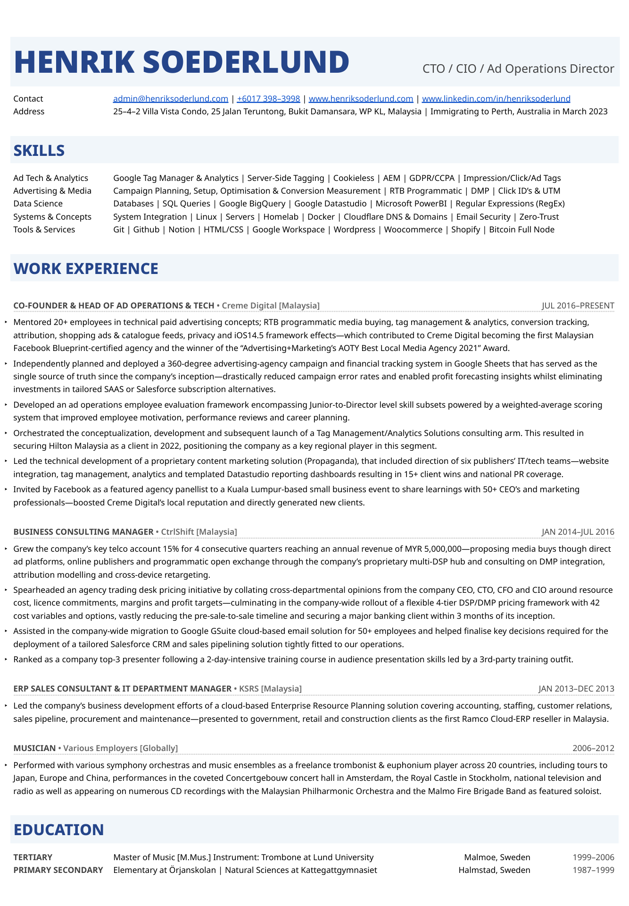

## Co-Founder & Head Of Ad Operations & Tech

**Creme Digital [Malaysia]**

*JUL 2016–PRESENT*

- Mentored 20+ employees in technical paid advertising concepts; RTB programmatic media buying, tag management & analytics, conversion tracking, attribution, shopping ads & catalogue feeds, privacy and iOS14.5 framework effects—which contributed to Creme Digital becoming the first Malaysian Facebook Blueprint-certified agency and the winner of the “Advertising+Marketing’s AOTY Best Local Media Agency 2021” Award.

- Independently planned and deployed a 360-degree advertising-agency campaign and financial tracking system in Google Sheets that has served as the single source of truth since the company’s inception—drastically reduced campaign error rates and enabled profit forecasting insights whilst eliminating investments in tailored SAAS or Salesforce subscription alternatives. 

- Developed an ad operations employee evaluation framework encompassing Junior-to-Director level skill subsets powered by a weighted-average scoring system that improved employee motivation, performance reviews and career planning.
Orchestrated the conceptualization, development and subsequent launch of a Tag Management/Analytics Solutions consulting arm. This resulted in securing Hilton Malaysia as a client in 2022, positioning the company as a key regional player in this segment.

- Led the technical development of a proprietary content marketing solution (Propaganda), that included direction of six publishers’ IT/tech teams—website integration, tag management, analytics and templated Datastudio reporting dashboards resulting in 15+ client wins and national PR coverage.

- Invited by Facebook as a featured agency panellist to a Kuala Lumpur-based small business event to share learnings with 50+ CEO’s and marketing professionals—boosted Creme Digital’s local reputation and directly generated new clients.

## Business Consulting Manager

**CtrlShift [Malaysia]**

*JAN 2014–JUL 2016*

- Grew the company’s key telco account 15% for 4 consecutive quarters reaching an annual revenue of MYR 5,000,000—proposing media buys though direct ad platforms, online publishers and programmatic open exchange through the company’s proprietary multi-DSP hub and consulting on DMP integration, attribution modelling and cross-device retargeting.

- Spearheaded an agency trading desk pricing initiative by collating cross-departmental opinions from the company CEO, CTO, CFO and CIO around resource cost, licence commitments, margins and profit targets—culminating in the company-wide rollout of a flexible 4-tier DSP/DMP pricing framework with 42 cost variables and options, vastly reducing the pre-sale-to-sale timeline and securing a major banking client within 3 months of its inception.

- Assisted in the company-wide migration to Google GSuite cloud-based email solution for 50+ employees and helped finalise key decisions required for the deployment of a tailored Salesforce CRM and sales pipelining solution tightly fitted to our operations.

- Ranked as a company top-3 presenter following a 2-day-intensive training course in audience presentation skills led by a 3rd-party training outfit.

## Erp Sales Consultant & It Department Manager

**KSRS [Malaysia]**

*JAN 2013–DEC 2013*

- Led the company’s business development efforts of a cloud-based Enterprise Resource Planning solution covering accounting, staffing, customer relations, sales pipeline, procurement and maintenance—presented to government, retail and construction clients as the first Ramco Cloud-ERP reseller in Malaysia.

## Musician

**Various Employers [Globally]**

*2006–2012*

- Performed with various symphony orchestras and music ensembles as a freelance trombonist & euphonium player across 20 countries, including tours to Japan, Europe and China, performances in the coveted Concertgebouw concert hall in Amsterdam, the Royal Castle in Stockholm, national television and radio as well as appearing on numerous CD recordings with the Malaysian Philharmonic Orchestra and the Malmo Fire Brigade Band as featured soloist.

  
  
    <a class="btn btn-outline-dark px-3 py-2" href="https://www.dropbox.com/s/zxajgv6pz2xxjb8/Henrik%20Soederlund%20-%20Resume.pdf?dl=1" role="button">Download my full Resume</a>
  

<!--  -->